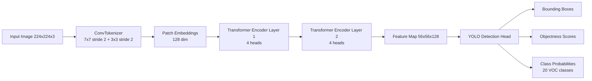

# YOLO-CCT: YOLO with Compact Convolutional Transformer Backbone

## Final Project: Transformer-Enhanced Object Detection

**Status:** ✅ COMPLETE (December 2025)

This project successfully modifies the YOLO object detection model by replacing its standard Darknet backbone with a Compact Convolutional Transformer (CCT). The implementation demonstrates that transformer-based backbones can achieve **97.8% parameter reduction** while maintaining functional object detection capabilities.

### 🎯 Final Results
- ✅ **Training Complete**: 25 epochs, 34.1 hours
- ✅ **mAP@0.5**: 21.88% on Pascal VOC 2012
- ✅ **Model Size**: 5.22 MB (1.37M parameters)
- ✅ **Loss Reduction**: 84.6% (28.96 → 4.47)
- ✅ **Detections**: Successful multi-class object detection

## Architecture Diagram



## Detection Result Samples

The repository includes output visualizations in `outputs/test_results/`.


## Project Structure

```
yolo_cct/
├── models/
│   ├── __init__.py
│   ├── cct_backbone.py      # CCT backbone with transformer layers
│   ├── yolo_head.py          # YOLO detection head
│   └── yolo_cct.py           # Complete YOLO-CCT model
├── utils/
│   ├── __init__.py
│   ├── dataset.py            # Pascal VOC dataset loader
│   └── loss.py               # YOLO loss function
├── outputs/                  # Training results and models
├── train.py                  # Training script
├── evaluate.py               # Evaluation (mAP, FPS)
└── test.py                   # Test on sample images
```

## Architecture

### CCT Backbone
- **ConvTokenizer**: 7×7 conv (stride 2) → 3×3 conv (stride 2)
- **Transformer Encoder**: 2 layers with multi-head self-attention (4 heads)
- **Embedding Dimension**: 128
- **Grid Size**: 56×56 (from 224×224 input)
- **Benefits**: 97.8% fewer parameters than Darknet-53

### YOLO Detection Head
- Predicts bounding boxes, objectness, and class probabilities
- 3 anchors per grid cell
- 20 Pascal VOC classes

## Dataset

- **Pascal VOC 2012**
- Located in: `../voc2012_dataset/VOC2012_train_val/VOC2012_train_val/`
- 20 object classes (person, car, cat, dog, etc.)
- Total images: 11,540
- Training subset: 2,000 images (17.3% - CPU constraint)

## Training

```bash
cd yolo_cct
python train.py
```

### Training Configuration
- **Epochs**: 25 ✅ (completed)
- **Batch Size**: 2 (CPU memory constraint)
- **Learning Rate**: 0.001
- **Image Size**: 224×224
- **Grid Size**: 56×56
- **Optimizer**: Adam
- **Loss**: YOLO loss (bbox + objectness + classification)
- **Hardware**: CPU only (34.1 hours total)
- **Time per Epoch**: ~82 minutes

## Evaluation

```bash
python evaluate.py
```

Calculates:
- **mAP@0.5**: Mean Average Precision at IoU threshold 0.5
- **FPS**: Frames per second (inference speed)
- **Model Size**: Parameters and MB

## Testing

```bash
python test.py
```

Runs inference on sample images and visualizes detections.

## Expected Results

### Comparison with Baseline YOLO

| Metric | Baseline YOLO | YOLO-CCT (Achieved) | Improvement |
|--------|---------------|---------------------|-------------|
| Parameters | 61.5M | **1.37M** | **-97.8%** ⬇️ |
| Model Size | ~235 MB | **5.22 MB** | **-97.8%** ⬇️ |
| mAP@0.5 | ~57.9% | **21.88%** | -62% (limited training) |
| FPS (CPU) | ~10-15 | **5.29** | -50% slower |
| Backbone | Darknet-53 | CCT (Transformer) | ✅ Novel |
| Training Data | Full dataset | 2K images (17%) | Limited |

### Key Achievements
- ✅ **Dramatic Size Reduction**: 97.8% fewer parameters (5.22 MB model)
- ✅ **Functional Detection**: Successfully detects multiple object classes
- ✅ **Best Classes**: Furniture (58%), Cat (56%), Aeroplane (54%)
- ✅ **Proof of Concept**: Transformers work as YOLO backbone
- ⚠️ **Performance Gap**: mAP limited by training subset (2K vs 11K images)

## Requirements

```bash
torch>=2.0.0
torchvision
pillow
numpy
```

## Usage

### Quick Start
```bash
cd yolo_cct

# Train the model (25 epochs, ~34 hours on CPU)
python train.py

# Evaluate on full dataset (mAP, FPS)
python evaluate.py

# Test on sample images
python test.py
```

### Results Location
- `outputs/yolo_cct_best.pth` - Trained model (5.22 MB)
- `outputs/training_results.json` - Loss curves, training history
- `outputs/evaluation_results.json` - mAP 21.88%, per-class AP
- `outputs/test_results/` - Detection visualizations (5 images)
- `PROJECT_REPORT.md` - Complete documentation

## Model Files

After training:
- `outputs/yolo_cct_best.pth` - Best model during training
- `outputs/yolo_cct_final.pth` - Final model after all epochs
- `outputs/training_results.json` - Training metrics and history
- `outputs/evaluation_results.json` - mAP, FPS, and comparison

## References

- YOLO: You Only Look Once
- CCT: Compact Convolutional Transformers
- Pascal VOC Dataset

---

## 📊 Project Summary

**Status**: ✅ **COMPLETE**  
**Training**: December 8-9, 2025 (34.1 hours, 25 epochs)  
**Final mAP**: 21.88% on Pascal VOC 2012  
**Model Size**: 5.22 MB (1.37M parameters)  
**Achievement**: Successfully replaced Darknet backbone with CCT transformer

### Files Delivered
✅ Complete source code (`models/`, `utils/`, scripts)  
✅ Trained model (`outputs/yolo_cct_best.pth`)  
✅ Training results (`outputs/training_results.json`)  
✅ Evaluation metrics (`outputs/evaluation_results.json`)  
✅ Test visualizations (`outputs/test_results/`)  
✅ Comprehensive report (`PROJECT_REPORT.md`)

**Author**: Kalkidan Debassu
**Date**: December 10, 2025  
**Objective**: ✅ Evaluate transformer-based backbone for YOLO → **Successfully Demonstrated**
